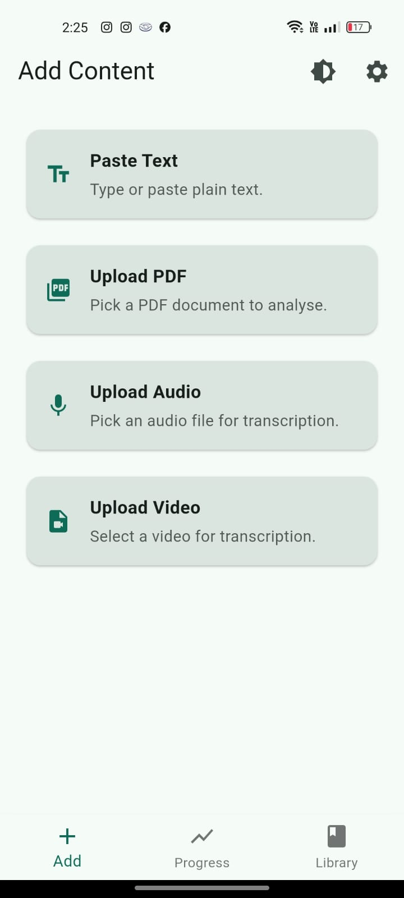
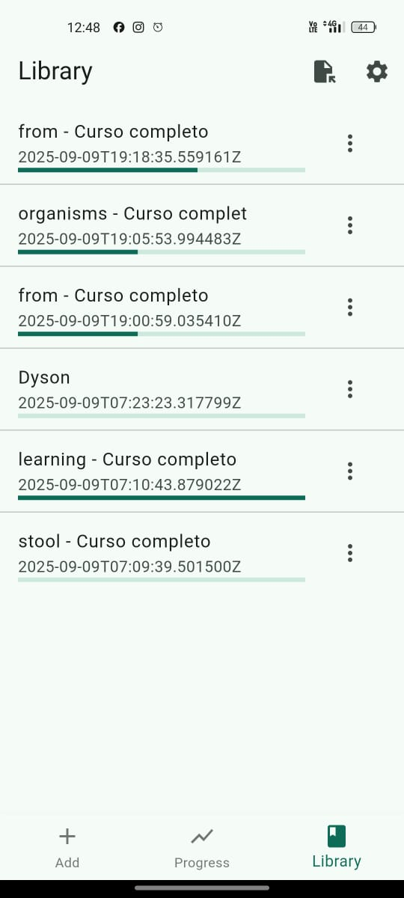
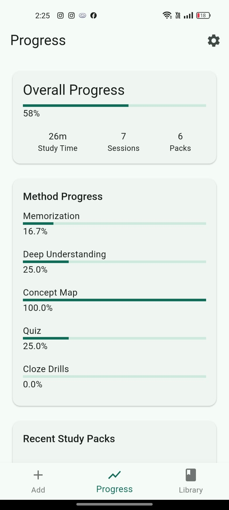

# LearnSynth

Turn **text, audio, or video** into ready‑to‑study material — summaries, concept maps, quizzes, cloze drills, flashcards, and TTS. Built with a **Flutter** client and a **FastAPI** backend that orchestrates LLMs, transcription, OCR and export.

<p align="center">
  <a href="https://github.com/AlexPraxedes12/LearnSynth/releases/tag/v0.3.0">
    
  </a>
  <a href="https://github.com/AlexPraxedes12/LearnSynth/releases/tag/v0.3.0">
    
  </a>
  <a href="https://youtu.be/tUp1egYCSEA">
    
  </a>
  <a href="https://learnsynth.com">
    
  </a>
</p>

<p align="center">
  
  
  
  
  
</p>

---

## TL;DR for judges

- **Try it on the web:** <https://learnsynth.com>  
- **Android:** download the **APK** from the [v0.3.0 release](https://github.com/AlexPraxedes12/LearnSynth/releases/tag/v0.3.0) and install (enable *Install unknown apps*).
- **Windows:** download the Windows installer/zip from the same release and run (if SmartScreen appears: *More info → Run anyway*).
- **Demo video (3 min):** <https://youtu.be/tUp1egYCSEA>

---

## How it uses **GPT‑OSS‑20B** (OpenAI open model)

LearnSynth was designed to operate with open models. For this hackathon the app prioritizes **gpt‑oss‑20b** (the OpenAI open source LLM) for the generation steps (summaries, flashcards, cloze, concept map descriptors). The backend routes requests to an **OpenAI‑compatible endpoint** and supports provider swapping, so gpt‑oss‑20b can run via a hosted inference endpoint or a local/OSS stack. Other providers can be enabled as fallbacks when needed.

- Primary open model: **gpt‑oss‑20b**
- Compatible wiring: OpenAI‑style `/v1/chat/completions` (streaming) exposed as `/llm/generate` to the client.
- Fallbacks (optional): other open‑weights or SaaS providers when configured via env vars.

---

## Features

- **One‑click study pack** from text, PDF, audio or video
- **Summaries & deep prompts** for reflection
- **Concept map** data and image export
- **Quizzes & cloze drills** with quick validation
- **Flashcards + simple SRS** progression
- **Whisper** transcription (for AV input)
- **OCR** (PyMuPDF + Tesseract) for scanned PDFs
- **Text‑to‑speech** (gTTS) for narration
- **Exports** to Markdown / TXT / PDF

---

## Screenshots

<p align="center">
  
  
  
</p>

---

## Architecture (high level)

```
Flutter (Android / Windows / Web)
        │
        ▼
 FastAPI backend  ──► /upload-content  (ingest: text/pdf/audio/video → text)
        │           └► /analyze        (summaries, map, prompts, quiz, flashcards)
        │           └► /llm/generate   (streaming, OpenAI‑compatible)
        │
        ├─ Transcription: Whisper
        ├─ PDF + OCR: PyMuPDF, pdf2image, Tesseract
        ├─ TTS: gTTS
        └─ LLM providers: **gpt‑oss‑20b** (primary), fallbacks via env
```

---

## Build & run (client)

The app reads two compile‑time flags:

- `API_BASE` – backend URL (defaults to a production value in release builds; override if yours differs)
- `ENABLE_OFFLINE_LLM` – feature flag for local/offline models (defaults to **false**)

### Web (release)

```bash
flutter build web --release   --dart-define=API_BASE=https://learnsynth-api.fly.dev   --dart-define=ENABLE_OFFLINE_LLM=false
```

### Windows (release)

```bash
flutter build windows --release   --dart-define=API_BASE=https://learnsynth-api.fly.dev   --dart-define=ENABLE_OFFLINE_LLM=false
```

### Android (APK)

```bash
flutter build apk --release   --dart-define=API_BASE=https://learnsynth-api.fly.dev   --dart-define=ENABLE_OFFLINE_LLM=false
```

### Local testing (enable offline path)

```bash
flutter run   --dart-define=API_BASE=http://localhost:8000   --dart-define=ENABLE_OFFLINE_LLM=true
```

> If you don’t pass `API_BASE`, the app will use the compiled default. Only set `ENABLE_OFFLINE_LLM=true` if you also provide a local model path and platform support.

---

## Backend (FastAPI)

### Quick start (Docker Compose)

```bash
cd backend
cp .env.example .env
docker compose up --build
```

Endpoints (selected):
- `POST /upload-content` – ingest text, PDF, audio, or video
- `POST /analyze` – build the study pack in parallel (summary, map, prompts, quiz, flashcards)
- `POST /llm/generate` – streaming OpenAI‑compatible completions for the UI
- `POST /speak` – text‑to‑speech (MP3)
- `POST /export` – export Markdown → TXT/PDF

Environment variables (excerpt):
```
LLM_PROVIDER=oss
LLM_FALLBACK_PROVIDER=
OSS_API_BASE=...     # OpenAI‑compatible endpoint for gpt‑oss‑20b
OSS_MODEL=gpt-oss-20b
OPENAI_API_KEY=...
ANTHROPIC_API_KEY=...
MAX_MEDIA_BYTES=104857600
```

> **Security:** never commit real keys. The repo ignores `.env`; sample values live in `.env.example`.

---

## Tech stack

- **Client:** Flutter/Dart (`provider`, `shared_preferences`, `hive`, `ffmpeg_kit_flutter_new`, etc.)
- **Server:** Python 3.11, FastAPI, Uvicorn, `httpx`, `sse-starlette`
- **LLM:** **gpt‑oss‑20b** (primary, OpenAI open model) with provider‑swap capability
- **Transcription:** Whisper
- **OCR & PDF:** PyMuPDF, pdf2image, Tesseract
- **TTS:** gTTS
- **Packaging/Infra:** Docker, Compose (ready for Cloud Run / Railway / Render)

---

## Why it matters

Learners spend *time* collecting and organizing notes. LearnSynth compresses that into seconds, turning arbitrary inputs into structured, multi‑modal study kits that actually stick.

---

## Roadmap

- In‑app editing for concept maps
- Better quiz validation + distractor quality
- Model selector (when multiple OSS endpoints are available)
- iOS packaging & macOS build

---

## License

MIT — see `LICENSE`.

